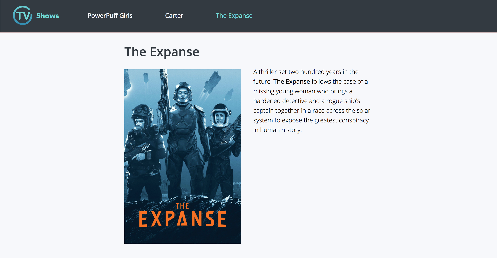
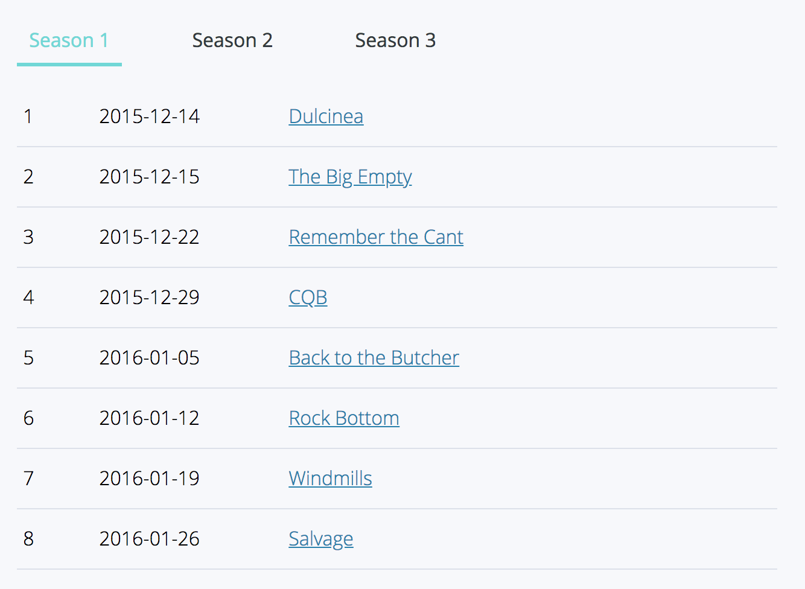

ReactJS: TV Guide
================



## Setup

This application has been:
 
 - created with `create-react-app`.
 - ejected to make __scss__ additions to webpack.
 - __Redux__ installed for state management

Once downloaded install with 

```console
npm install
```

And run with 

```console
npm start
```

## CSS Methodology

The css methodology being used is BEVM, which is an alteration of the BEM modifier to split it into variation and modifier.

For an example of this, read [here](https://www.viget.com/articles/bem-sass-modifiers/) and view `component/_button.scss`

Additional directories added based on Harry Robert's namespacing technique linked [here](https://csswizardry.com/2015/03/more-transparent-ui-code-with-namespaces/) and [here](https://www.smashingmagazine.com/2016/06/battling-bem-extended-edition-common-problems-and-how-to-avoid-them/)

## Directory Structure

```
src/actions - Redux actions
src/components - Stateless React components
src/constants - Redux constants
src/containers - React containers
src/reducers - Redux reducers
src/sass - All SASS styles, for structure information see /sass/main.scss
```

## What I would like to change / TODOs

- Directories would be more modular with [domain driven design](https://medium.com/@hassan.djirdeh/domain-driven-react-redux-a474ecf7d126).
- Sass files could be included in each component directory to make them easier to locate.
- A service for http requests would keep requests consistent and could potentially manage other information (like authentication and default headers).
- Better handling of loading. The application needs to handle the loading of data in the front-end. For example, when you load episode information, the episode is '0' for a brief moment because it doesn't have the information. An example where this has been handled can be seen in [this project](https://github.com/MrVann/React-Mongo-Recipe-App/blob/master/src/recipe/recipe/RecipeContainer.js).

> This has been added in a [later project](https://github.com/MrVann/React-Mongo-Recipe-App).

## More examples

### Seasons Component



